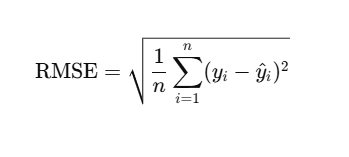
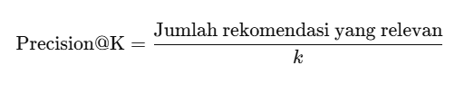
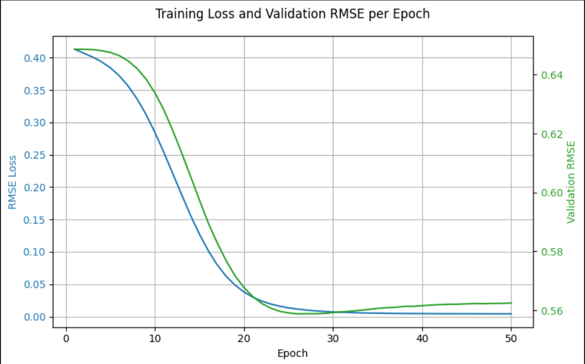

# Laporan Proyek Sistem Rekomendasi Wisata Yogyakarta - Muhammad Fharahbi Fachri

## Project Overview

Yogyakarta adalah satu-satunya daerah Istimewa yang dikenal karena sejarahnya. Selain itu Yogyakarta sering disebut kota pelajar. Selain dikenal karena kota pelajar dan sejarahnya, Yogyakarta termasuk kota yang memiliki berbagai macam jenis da tempat wisata yang menarik dan dikunjungi. Untuk memudahkan wisatawan yang berasal dari luar, sistem rekomendasi merupakan hal yang baik untuk digunakan kepada mereka[1].

Sistem rekomendasi adalah sebuah sistem yang memberikan kita informasi rekomendasi. Dalam kasus ini, sistem rekomendasi akan membuatkan informasi rekomendasi tempat-tempat wisata yang harus dikunjungi oleh pengguna agar memudahkan pengguna supaya tidak kebingungan ketika berpergian[2].  

Pengguna seringkali kebingungan atau kelelahan dalam menavigasi jumlah informasi yang tersedia. Dalam pencarian tempat wisata, banyaknya informasi dapat membuat sulit bagi orang untuk memilih tempat yang tepat. Mereka kesulitan membedakan informasi yang penting dari yang tidak penting, serta menyesuaikan preferensi mereka dengan pilihan mereka saat ini. Maka dari itu sistem rekomendasi wisata Yogyakarta dibuat[3].

## Referensi 

[1]	E. Suhailah and Hartatik, “Pembuatan Sistem Rekomendasi Pariwisata Yogyakarta Menggunakan Triangle Multiplaying Jaccard Creating a Yogyakarta Tourism Recommendation System Using Triangle Multiplaying Jaccard,” JACIS  J. Autom. Comput. Inf. Syst., vol. 3, no. 2, pp. 115–126, 2023.

[2]	S. Devi Nurhayati and W. Widayani, “Sistem Rekomendasi Wisata Kuliner di Yogyakarta dengan Metode Item-Based Collaborative Filtering Yogyakarta Culinary Recommendation System with Item-Based Collaborative Filtering Method,” JACIS  J. Autom. Comput. Inf. Syst., vol. 1, no. 2, pp. 55–63, 2021, [Online]. Available: https://manganenakyog.my.id/,

[3]	A. Sispianygala, S. Sandino Berutu, and J. Jatmitka, “Pengembangan Aplikasi Sistem Rekomendasi Tempat Wisata Dengan Collaborative Filtering,” Progresif J. Ilm. Komput., vol. 20, pp. 828–838, 2024.

## Business Understanding

###  Problem Statements:

- Bagaimana membangun sistem rekomendasi wisata untuk daerah Yogyakarta?

- Bagaimana memanfaatkan data destinasi wisata dan data pengguna untuk menghasilkan rekomendasi yang relevan?

### Goals:

- Membuat sebuah sistem rekomendasi berbasis data yang dapat secara otomatis menyarankan destinasi wisata di Yogyakarta kepada wisatawan.

-  Menerapkan teknik machine learning dalam menganalisis data pengguna dan data tempat wisata, sehingga sistem dapat mempersonalisasi rekomendasi berdasarkan preferensi pengguna yang terdahulu atau karakteristik tempat wisata.

### Solution Statements

- Membangun model dengan menggunakan content-based-filtering dan collaborative filtering.

- Menggunakan pengukuran model dengan melihat RMSE pada model collaborative filtering dan precission@k pada conten-based-filtering.

## Data Understanding

### Sumber dan Informasi Dataset

- **Sumber dan Informasi Dataset:** Berikut adalah tautan dataset yang digunakan pada proyek ini [Sistem Rekomendasi Yogyakarta](https://www.kaggle.com/datasets/aprabowo/indonesia-tourism-destination/data)

-**Jumlah Data:**  Terdapat 3 data yang digunakan yaitu:
  - tourism_rating.csv (Terdapat 10000 baris dan 3 kolom dengan tipe data berbentuk integer)
  - tourism_with_id (Terdapat 437 baris dan 13 kolom dengan tipe data 3 integer,5 objek, dan 5 float)
  - user.csv (Terdapat 300 baris 3 kolom dengan tipe data 2 integer dan 1 objek )
-**Kondisi Data:** Berdasarkan table:
 - tourism_rating.csv : Tidak memiliki data yang kosong tetapi memiliki data yang terduplikat sebanyak 79.
 - tourism_with_id : Terdapat data kosong pada kolom time_minutes sebanyak 232 dan 437 kosong pada kolom unnamed:11, serta tidak memiliki data yang kosong.
 - user.csv : Tidak terdapat data kosong dan terduplikat.

### Fitur-fitur pada dataset:
 - tourism_rating.csv:
   | No. | Nama Fitur      | Tipe Data | Deskripsi                                                                 |
   |-----|------------------|-----------|---------------------------------------------------------------------------|
   | 1   | User_Id          | Integer   | ID unik untuk setiap pengguna yang memberikan rating pada tempat wisata. |
   | 2   | Place_Id         | Integer   | ID unik untuk setiap tempat wisata yang dinilai oleh pengguna.           |
   | 3   | Place_Ratings    | Integer   | Nilai rating yang diberikan oleh pengguna terhadap tempat wisata.       |

 - taourism_with_id:
   | No | Nama Kolom     | Tipe Data | Deskripsi                                                                 |
   |----|----------------|-----------|---------------------------------------------------------------------------|
   | 1  | Place_Id       | int64     | ID unik untuk setiap tempat wisata.                                       |
   | 2  | Place_Name     | object    | Nama tempat wisata.                                                      |
   | 3  | Description    | object    | Deskripsi atau informasi umum tentang tempat wisata.                     |
   | 4  | Category       | object    | Kategori dari tempat wisata (misalnya: Budaya, Taman Hiburan, dll).      |
   | 5  | City           | object    | Kota tempat lokasi wisata berada.                                        |
   | 6  | Price          | int64     | Harga tiket masuk dalam satuan Rupiah.                                   |
   | 7  | Rating         | float64   | Rating tempat wisata berdasarkan ulasan pengguna.                        |
   | 8  | Time_Minutes   | float64   | Estimasi waktu yang dihabiskan di tempat tersebut (dalam menit).         |
   | 9  | Coordinate     | object    | Representasi koordinat dalam bentuk string JSON (berisi lat dan lng).    |
   | 10 | Lat            | float64   | Latitude (garis lintang) lokasi wisata.                                  |
   | 11 | Long           | float64   | Longitude (garis bujur) lokasi wisata.                                   |
   | 12 | Unnamed: 11    | float64   | Kolom kosong/tidak terpakai (semua nilai NaN).                           |
   | 13 | Unnamed: 12    | int64     | Duplikasi dari Place_Id, tidak diperlukan.                               |

 - user.csv : 
   | No | Nama Kolom | Tipe Data | Deskripsi                                                                 |
   |----|------------|-----------|---------------------------------------------------------------------------|
   | 1  | User_Id    | int64     | ID unik yang merepresentasikan masing-masing pengguna.                    |
   | 2  | Location   | object    | Lokasi pengguna dalam format "Kota, Provinsi".                            |
   | 3  | Age        | int64     | Umur pengguna dalam satuan tahun.                                         |

### Analisis Hasil Exploratory Data Analysis (EDA):

 - Visualisasi sebaran data wisata antar kota dan presentase yang didapatkan adalah bahwa Yogyakarta memiliki data dengan wisata terbanyak sebanyak 60 dengan 29.3 % dari pada bandung, jakarta, surabaya, dan semarang(oleh karena itu sistem rekomendasi yang dibangun menggunakan kota Yogyakarta).

 - Visualisasi sebaran jenis/tipe wisata di Yogyakarta dan presentasenya menunjukkan bahwa taman hiburan memiliki jumlah yang banyak yaitu 22 dengan 36.7%.

## Data Preparation

**Langkah-langkah data preparation:**

1. **Drop kolom yang tidak perlu**:
    - Pada Tabel tourism_with_id terdapat kolom unnamed 11 dan 12 yang tidak perlu digunakan maka dari itu kolom tersebut di hapus atau drop. Kemudian `wisata = wisata.dropna()`  memiliki fungsi untuk menghapus baris-baris yang memiliki nilai kosong (missing values / NaN) dari DataFrame wisata.

2. **Mengambil Kota Yogyakarta**:
    - Berdasarkan hasil EDA sebelumnya,karena memakai Yogyakarta, disini mengambil City == Yogyakarta pada data tourism_with_id, dan disimpan kedalam data sementara yaitu wisataYogyakarta.

3. **Mengambil rating Kota Yogyakarta**:
    - Setelah mengambil city, selajutnya mengambil rating pada data tourism_rating, dan mengambil place_id pada data wisataYogyakarta, kemudian digabungkan serta disimpan pada data baru yaitu rating_jogja.

4. **Mengambil data user dan digabungkan pada rating_Yogyakarta**:
    - Mengambil data user dengan digabungkan pada data rating_jogja dengan mangambil user_idnya saja dan disimpan pada data user_jogja.

5. **Menghapus data duplikat**:
    - rating_jogja disimpan dengan variable Yogyakarta dan kemudian menghapus duplikat pada kolom place_id.

6. **Menggabungkan semua data**:
    - Menggabungkan semua data kedalam allYogyakarta, dimana data Yogyakarta dan wisataYogyakarta pada kolom Place_id, place_name, dan category di gabungkan.

7. **Mengambil Fitur yang diperlukan(Content-Based-Filtering)**:
    - Pada data all_Yogyakarta mengambil kolom place_id, place_name, dan category.

8. **Seleksi fitur(collaborative filtering)**:
    - Mengambil daftar unik User_Id dari dataset rating_jogja, membuat dictionary pemetaan dari User_Id asli ke indeks numerik (encoding user), dan # Membuat dictionary kebalikan: dari indeks numerik ke User_Id asli.

    - Mengambil daftar unik Place_Id (tempat wisata) dari dataset, membuat dictionary pemetaan dari Place_Id asli ke indeks numerik (encoding wisata), membuat dictionary kebalikan: dari indeks numerik ke Place_Id asli.

    - Menambahkan kolom baru 'user' di dataframe rating_jogja dengan hasil encoding user, menambahkan kolom baru 'wisata' di dataframe rating_jogja dengan hasil encoding wisata.

9. **Inisialisasi CountVectorizer().**:
    - Bertujuan untuk mengubah data teks dalam kolom 'Category' menjadi fitur-fitur numerik yang bisa diproses oleh algoritma.
    - Untuk mengubah data teks (dalam hal ini: kolom Category) menjadi representasi angka berdasarkan frekuensi kata (bag-of-words).
    - Membangun "kamus" atau "vocabulary" dari semua kata unik yang muncul dalam kategori tempat wisata.
10. **Normalisasi (collaborative filtering)**:
    - Normalisasi rating_jogja pada kolom place_Ratings.
    - Mengambil nilai x yaitu user dan wisata dari data rating_jogja.
    - y mengambil place rating pada data rating_jogja dan normalisasi min-max terhadap kolom Place_Ratings.

11. **Train test split(collaborative filtering)**:
    - Data dibagi menjadi 80% training dan 20% test

## Modeling

### Model Yang Digunakan 

1. **Collaborative Filtering (Berbasis User/Item)**:
    - Model ini merekomendasikan tempat berdasarkan interaksi pengguna sebelumnya, seperti rating atau kunjungan. Dua pendekatan utama:
        - User-Based CF: merekomendasikan tempat yang disukai oleh pengguna yang mirip.
        - Item-Based CF: merekomendasikan tempat yang mirip dengan yang sudah disukai pengguna.
    
    - Parameter yang digunakan:
        - Tipe Model : Matrix Factorization (user-item embedding).
        - Jumlah Layer : 2 layer embedding (user dan item).
        - Ukuran Embedding : 50.
        - Aktivasi : Tidak ada.
        - Loss Function : MSE.
        - Optimizer : Adam.
        - Parameter Training: 
            - Epoch : 50.
            - Batch Size : 64.
            - Callback : RMSE tracking per epoch.

    - Kegunaan Parameter:
        - Tipe Model: Matrix Factorization (Embedding User-Item).Digunakan untuk sistem rekomendasi. Mengubah ID user dan item menjadi vektor laten untuk memprediksi preferensi.
        -  Struktur Model
            - User Embedding Layer: Mewakili pengguna sebagai vektor berdimensi 50.

            - Item Embedding Layer: Mewakili tempat wisata sebagai vektor berdimensi 50.

            - Output: Dot product antar vektor user dan item → menghasilkan skor prediksi.

        - Konfigurasi Pelatihan
            - Loss Function: MSE – menghitung kesalahan prediksi.

            - Optimizer: Adam – cepat dan stabil.

            - Epochs: 50 – cukup untuk konvergensi.

            - Batch Size: 64 – efisien untuk data sedang.

            - Callback: RMSELogger – mencatat RMSE setiap epoch untuk evaluasi performa.

    - Kelebihan :
        - Tidak membutuhkan informasi eksplisit dari tempat (hanya interaksi user-item).
        - Bisa menangkap preferensi kompleks berdasarkan perilaku pengguna.
    
    - Kekurangan : 
        - Cold Start Problem: tidak efektif untuk pengguna atau item baru.
        - Membutuhkan cukup banyak data interaksi pengguna agar akurat.
    
2. **Content-Based Filtering**:
    - Model ini menggunakan Cosine similarity. Cosine similarity adalah salah satu metode paling umum untuk mengukur kemiripan antara dua vektor dalam ruang vektor, kemudian fungsi cosine similaryity disini menghitung kesamaan (similarity) antar setiap tempat wisata berdasarkan representasi vektor dari kategori (TF-IDF atau BoW).

    - Model ini merekomendasikan tempat berdasarkan kemiripan fitur kontennya dengan yang pernah disukai pengguna.

    - Kelebihan : 
        - Tidak memerlukan data dari pengguna lain.
        - Mengatasi masalah cold-start untuk item baru.
    
    - Kekurangan : 
        - Terbatas pada apa yang sudah disukai pengguna sebelumnya.
        - Tidak bisa menangkap selera yang beragam (sering merekomendasikan yang terlalu mirip).

### Output: Top-N Recommendation 

1. **Collaborative Filtering (Berbasis User/Item)**:
    - Berikut adalah 5 rekomendasi teratas untuk **User ID: 10** berdasarkan prediksi rating:

        | Peringkat | Nama Tempat Wisata                              | ID Tempat | Predicted Rating |
        |-----------|--------------------------------------------------|-----------|------------------|
        | 1         | Desa Wisata Gamplong                            | 134       | 4.99             |
        | 2         | Pantai Timang                                   | 168       | 4.98             |
        | 3         | Desa Wisata Rumah Domes/Teletubbies             | 145       | 3.03             |
        | 4         | Candi Donotirto                                 | 105       | 2.69             |
        | 5         | Desa Wisata Kelor                               | 151       | 2.55             |

> 📌 *Predicted Rating* menunjukkan seberapa besar kemungkinan user menyukai tempat tersebut, berdasarkan hasil prediksi model.

2. **Content-Based Filtering**:
    - Berikut adalah hasil rekomendasi berdasarkan input `Situs Warungboto`:

      | No  | Place_Name                                | Category       |
      |-----|--------------------------------------------|----------------|
      | 0   | Jogja Exotarium                            | Taman Hiburan  |
      | 1   | Studio Alam Gamplong                       | Taman Hiburan  |
      | 2   | Bukit Lintang Sewu                         | Taman Hiburan  |
      | 3   | Puncak Kebun Buah Mangunan                 | Taman Hiburan  |
      | 4   | Desa Wisata Rumah Domes/Teletubbies        | Taman Hiburan  |

## Evaluation

### **Matriks Evaluasi Yang Digunakan**:
* **Collaborative Filtering**:
 * **Root Mean Squared Error (RMSE)**:
     digunakan sebagai metrik evaluasi utama untuk menilai kinerja model Collaborative Filtering. RMSE digunakan untuk mengukur perbedaan antara nilai rating aktual dan nilai rating yang diprediksi oleh model.
 * **Penjelasan RMSE**:
    
    \( y_i \) = rating aktual  
    \( \hat{y}_i \) = rating hasil prediksi  
    \( n \) = jumlah data

 * **Cara Kerja**: 
    - Menghitung selisih antara nilai aktual dan prediksi.
    - Mengkuadratkan selisih tersebut untuk menghindari nilai negatif.
    - Mengambil rata-rata dari hasil kuadrat.
    - Mengakarkan hasilnya untuk mengembalikan skala ke satuan asli.

* **Conten-Based-Filtering**:
 * **Precission@k**:
    - Mengukur seberapa relevan hasil rekomendasi content-based filtering berdasarkan kategori tempat wisata yang sama.
    - Cara Kerja (Singkat):
        - Mengambil kategori dari tempat wisata acuan (misalnya: Situs Warungboto).
        - Mengambil top-k hasil rekomendasi dari fungsi rekomenjogja().
        - Mengecek berapa banyak tempat wisata rekomendasi yang memiliki kategori sama.
        - Menghitung Precision@K:
            
    - Digunakan untuk mengevaluasi performa model content-based dengan melihat proporsi rekomendasi yang benar-benar relevan (kategori sama) terhadap total rekomendasi yang diberikan.Semakin tinggi nilainya (mendekati 1), semakin baik rekomendasinya.

### **Hasil Berdasarkan Proyek**:
 * **Hasil**:
    - model Collaborative Filtering dilatih selama 50 epoch dengan callback untuk mencetak nilai RMSE pada data validasi di setiap epoch. Dinyatakan bahwa RMSE berhasil turun dengan hasil akhir 0.5464, yang menunjukkan bahwa model semakin akurat dalam memprediksi rating pengguna terhadap tempat wisata.Visualisasi menunjukkan grafik penurunan loss dan validation RMSE yang mengikuti pola serupa, mengindikasikan model tidak mengalami overfitting yang signifikan dan performanya stabil.

     **Visualisasi Training**:
     
    
    - model conten-based-filtering pada pengujian `situs warungboto` mendapat nilai 1.00 atau 100%,yang artinya untuk semua rokomendasi yang diberikan memiliki kesamaan yang mirip/sama persis.

### **Jawaban Problem Statement**
- Bagaimana membangun sistem rekomendasi wisata untuk daerah Yogyakarta?
    - Sistem yang dibangun sudah bisa menerapkan goal secara otomatis menyarankan destinasi wisata di Yogyakarta kepada wisatawan.
- Bagaimana memanfaatkan data destinasi wisata dan data pengguna untuk menghasilkan rekomendasi yang relevan?
    - Menggunakan 2 pendekatan model yaitu dengan conten based filtering dan juga collaborative filtering.
    - Berdasarkan problem statement,semua problem statement dan goal sudah tercapai dan menggunakan sulution statement dengan membangun model conten based filtering dan juga collaborative filtering serta menggunakan pengukuran RMSE pada collaborative-filtering dan precission@k pada conten-based-filtering.
